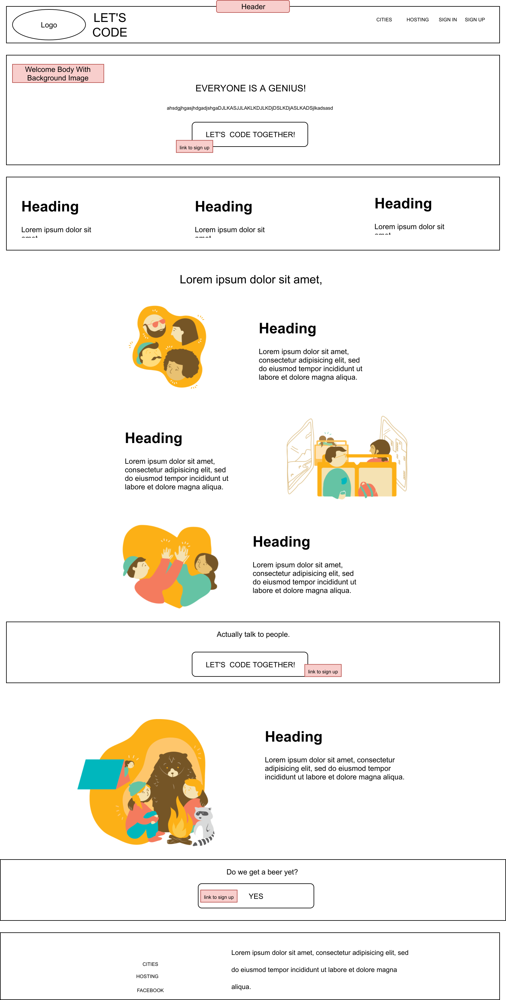
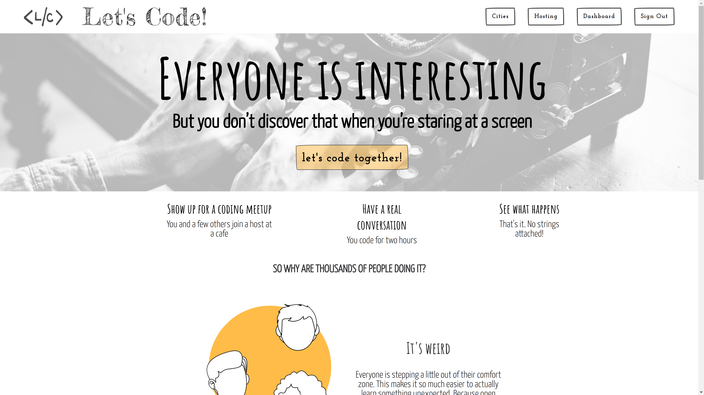
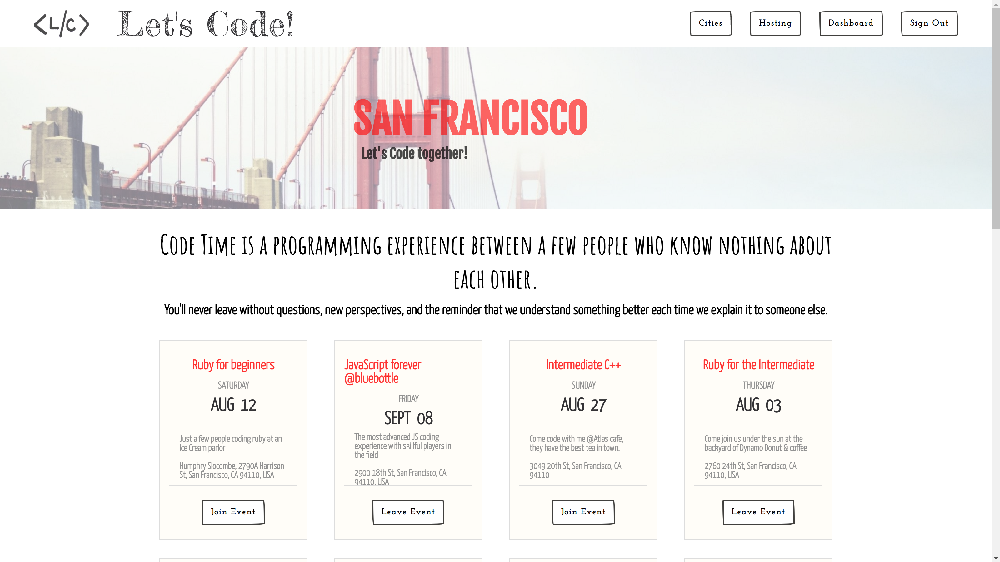
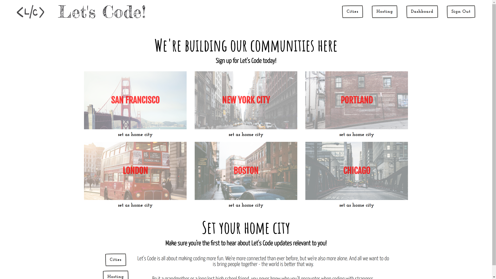
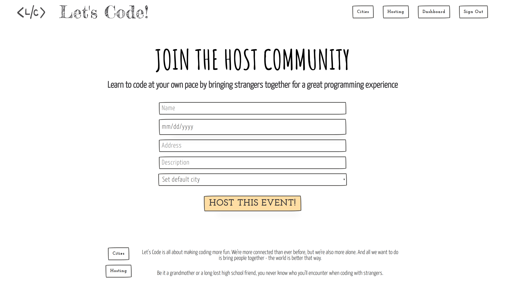

# Let's Code

[Live](http://letscode.site/)

Let's Code is a full-stack single web application inspired by Tea with Strangers built using Ruby on Rails utilizing React.js + Redux architecture. Let's Code allows users to organize meet ups in 6 different cities.

## Overall Structure

#### Back end

The app was built using Ruby on Rails on the back end with a postgreSQL database. Back end structure is RESTful and all the data requests use AJAX and are fulfilled with a JSON API. Associations are used to prefetch data in order to minimize SQL queries to the database.

#### Front end

The front end is built completely in React.js/Redux and JavaScript. React's virtual DOM allows for lightning-quick re-rendering without requiring new pages to be sent from the server. Modals also appear/disappear using React rather than toggling CSS display properties.

#### Libraries

- Ruby on Rails
- React
- Redux
- jQuery
- Database
  - PostgreSQL
- Gems
  - Jbuilder
  - BCrypt

## Primary Components

### Users, Events, Cities and Registrations

Users are stored in a table that houses their email, first_name, last_name, email, image_url and city_id.

Events are stored in a table that houses its name, description, date, host_id, city_id, and address.

Cities are stored in a table that houses its name and image_url, and city_abrv.

Registrations are stored in a table that houses an associated city_id, and associated user_id.

### Home Page

The home page provides general information about the web app.

#### Home Page wireframe



#### Home Page



### User Authorization

Passwords are digested using the `BCrypt` gem before being stored. Authentication uses `BCrypt` to match passwords to password digests.

### Users and Events

Users have the ability to attend and leave events, and create events.

The event component displays the information saved in the database's events table. In the database, each event is required to have a `date`, `name`, `address`, `description`, `host_id`, `city_id`. When logged in users can choose to join or leave an event from the City show page.

While in production, the state was deeply nested, that was helpful while creating the event city page as it requires having information about future events in the city and information about the user, if they are attending or not. While this was helpful in creating the page, interacting with join/leave events was complicated. A simple solution was derived to overcome function interaction and to simplify the code. I refactored the state from the backend, ajax requests were simplified, and interaction with the user and creating new features became much easier.



## state

the state was kept in a minimal state, only the necessary information were sent. It helps keep the user interaction simple, fast and the development of features faster and easier.

#### Sample from events jbuilder

```javascript
@events.each do |event|
  json.set! event.id do
    json.extract! event, :id, :name, :date, :description, :address, :city_id, :host_id
    if signed_in?
      json.attending !!(current_user.registered_events.find_by(id: event.id))
    else
      json.attending false
    end
  end
end
```

### Cities Index

Provides the user with a list of all of the cities. and allows the user to set a default city. By default if there's no default city, Hosting page will show a drop down menu to set the default city at the same time the user is creating an event. This is a security feature that only allows users to create events in their home cities. If they move, it's still easy to set a new home city from the cities index page.

#### Cities index



#### Hosting Page



### Dashboard

The Dashboard allows a logged in user to view all of the events that they are signed up for or are hosting.

### Future Directions for the Project

### Google Map API

Implement a Google Map API that drops a pin where the event is being hosted. This will allow the user to see all the events happening in the city on the map.

### Stripe

Stripe is a simple way to accept payments online and in mobile apps. It's widespread, and would allow the user to donate to the website if they wish to.
